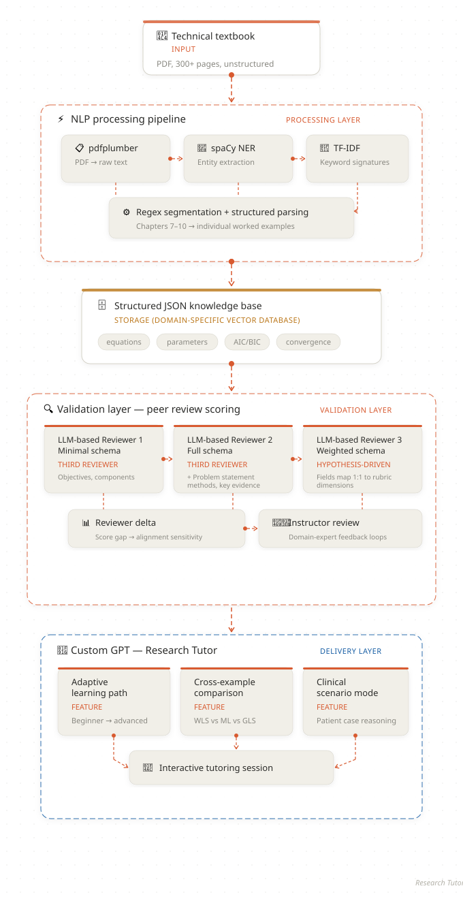

# Research Tutor

**Turn any technical textbook into your personal AI tutor.**

## The Idea

What if you could hand an AI your textbook and get back a personal tutor that actually understands the content — not just searches it?

We demonstrate this with pharmacology (PK/PD) modeling: a domain where complex, specialized knowledge sits at the intersection of biology and mathematics. Our approach decomposes modeling into two interpretable layers: the biological mechanisms (what's happening in the body) and the mathematical framework (how we describe it quantitatively).

## Demo

## The Problem

A 300-page modeling manual treats a first-year student and a seasoned researcher the same. Beginners may get stuck, skip ahead, or give up. The knowledge is there, but without a dynamic learning model, it stays locked on the page.

## The Features

### Automated Knowledge Pipeline

We built an automated pipeline that transforms unstructured PDF textbooks into structured, queryable JSON — essentially a lightweight, domain-specific vector database — and wires it into a Custom GPT that teaches, adapts, and reasons through real examples to save tokens. 

**PDF → NLP Pipeline → Structured JSON → Custom GPT Knowledge → Personal Tutor**

### Adaptive Learning Path

The tutor meets learners where they are. On first interaction, it runs a short diagnostic to assess the user's background; then dynamically adjusts its teaching strategy. Beginners are guided through intuitive analogies before seeing any equations. Intermediate learners get full derivations with biological interpretation. Advanced users jump straight into method comparisons, convergence edge cases, and estimation tradeoffs.

### Cross-Example Comparison Engine

Most textbooks teach estimation methods in isolation. This tutor pulls from multiple worked examples simultaneously, enabling side-by-side analysis of estimation methods that no static textbook can offer. Ask "When should I use MAP instead of maximum likelihood?" and the tutor retrieves parameter estimates, convergence diagnostics, and model selection criteria across examples then presents a structured comparison grounded in real output values.

### Clinical Scenario Mode

Textbook knowledge becomes bedside reasoning. The tutor presents a patient descriptions(for example, a 65-year-old with renal impairment receiving Drug X at a standard dose) and guides the learner through which model applies, which parameters are affected, and how to adjust dosing. Learners connect parameter changes (reduced clearance, shifted volume of distribution) to clinical consequences (accumulation, toxicity risk, therapeutic failure), reinforcing understanding through practice.

## Architecture

## Future Work

**Visual PK Curve Generation.** Using GPT's code interpreter and data analysis capabilities to plot concentration-time curves directly from PDF worked examples. Users see the two-compartment model visually with equations. Change a parameter, watch the curve shift. This turns abstract differential equations into something intuitive and immediate.

**Custom Actions — Make the Tutor Do, e.g. Review & Suggest Modeling Code.** The current GPT teaches through conversation. Future work can be considered integrating custom actions via API to make it interactive: running live PK simulations, generating concentration-time plots on demand, pulling real drug data from external databases, or exporting a student's learning progress.
