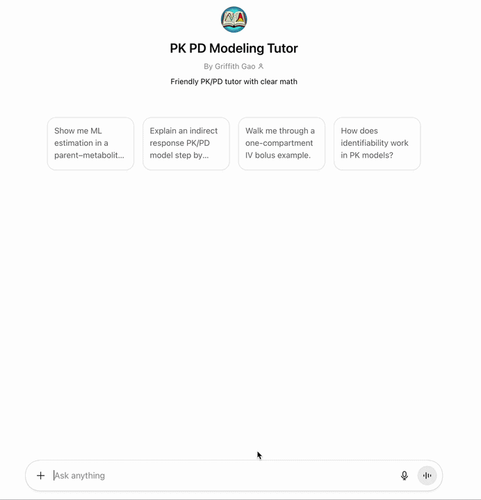

# PK/PD Modeling Tutor

**An AI system that teaches technical modeling through step-by-step structured reasoning.**

Demonstrates differential equations, statistical inference, and simulation: balancing mathematical rigor with intuitive explanation. Every parameter has meaning, every step is interpretable.

## Overview

Built as an AI tutor, this project walks users through the full modeling lifecycle: from problem formulation to parameter estimation to decision interpretation. This mirrors modern ML pipelines but with mechanistic, interpretable models.

## Demo

The system teaches **pharmacokinetic/pharmacodynamic (PK/PD) modeling**: how drug concentration and drug response can be modeled mathematically. Every equation describes real biological behavior, and every parameter has physiological meaning.

### End-to-End Modeling Workflow

The tutor walks through the full data science lifecycle (mirrors modern ML pipelines but with mechanistic models):

1. Model Formulation
2. Data Preparation
3. Parameter Estimation
4. Model Validation
5. Simulation
6. Decision Interpretation
